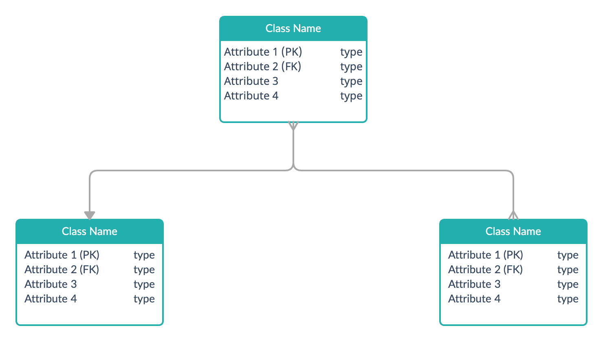

## Project title here
This project was bootstrapped with [Framework name here](https://github.com).

## About this project with description
- Point 1
- Point 2
- Point 3 and so on

## Requirements

* [Node Js v14](https://nodejs.org/en/download)
* [MongoDb v4](https://www.mongodb.com/try/download/community)


## SDK's Used in this project
* [Paypal](https://github.com/paypal?language=javascript)
* [MailChimp](https://github.com/mailchimp/mailchimp-transactional-node)
* [Mongoose](https://mongoosejs.com)

## Contact Person for AWS access
- Name: Person name
- Email: Person email

## Installation Instructions

Globally install xyz framework 
```bash
npm install -g xyz
```

- This installation is required due to xyz reason
## Setup Instructions
Clone the repo and install the dependencies.
```bash
npm install
```
```bash
Create .env file in the project root
```
```bash
Add these credentials in .env file
DBUri=<specify value here>

```

## Running on local

To start the server, run the following

```bash
npm start
```

## Deployment command

```bash
npm deploy
```

## Documentation
See the collection for documentation:

[](https://www.getpostman.com/collections/id)


## Architecture Diagram


## Flow Diagram


## Database Design
-  This is relational database design 
- Models are defined in src/models folder


## Wiki of one complex feature
- Read the detailed explanation of xyz feature 
- Wiki link: link here
